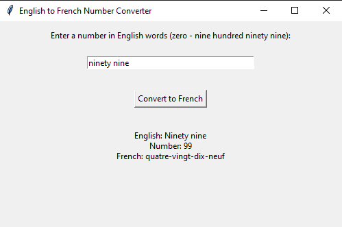

# VerbaNum

VerbaNum is a Python tool that translates numbers from English words to French using finite state automata (FSA). It processes English words into Arabic numerals and converts them to French equivalents, handling numbers from 0 to 999.

## Features

- Converts English words to Arabic numerals (e.g., "ninety-nine" to 99).
- Translates Arabic numerals to French words (e.g., 99 to "quatre-vingt-dix-neuf").
- Handles invalid input gracefully.

## Usage

1. Run the program:
   ```bash
   python main.py
   ```
2. Enter numbers in English words and get the output in French.
3. Type `quit` to exit.

## Example

**Input:**

```
ninety-nine
```

**Output:**

```
English: ninety-nine
Number: 99
French: quatre-vingt-dix-neuf
```


